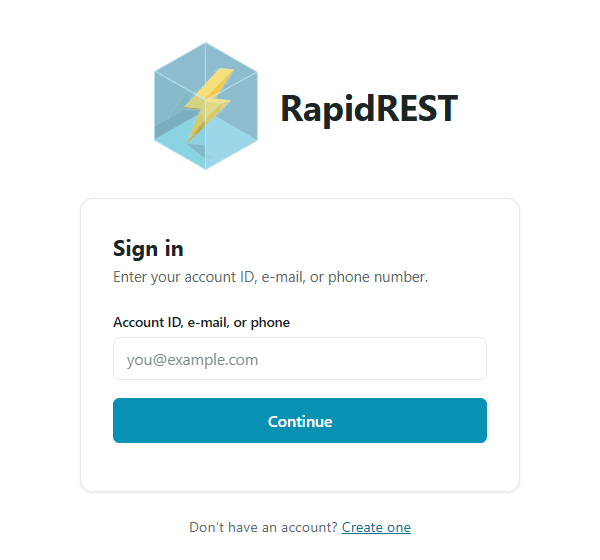
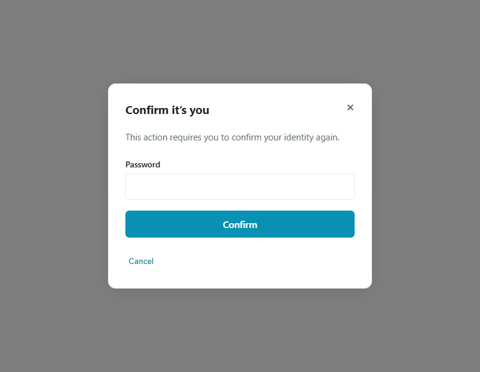
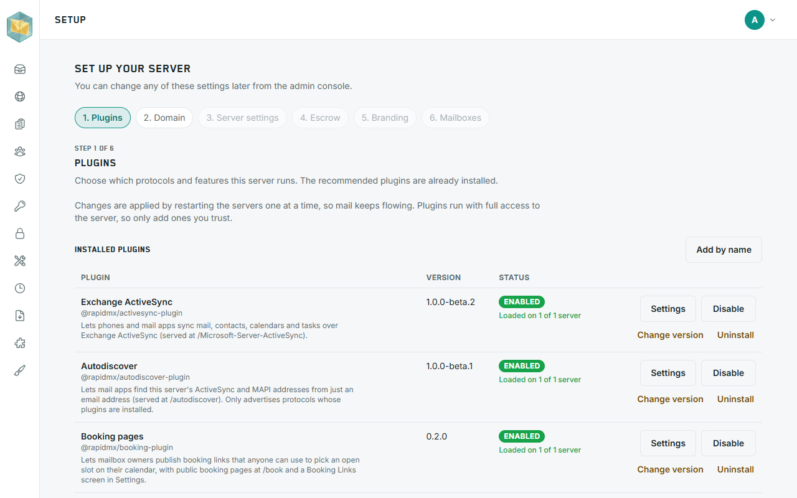
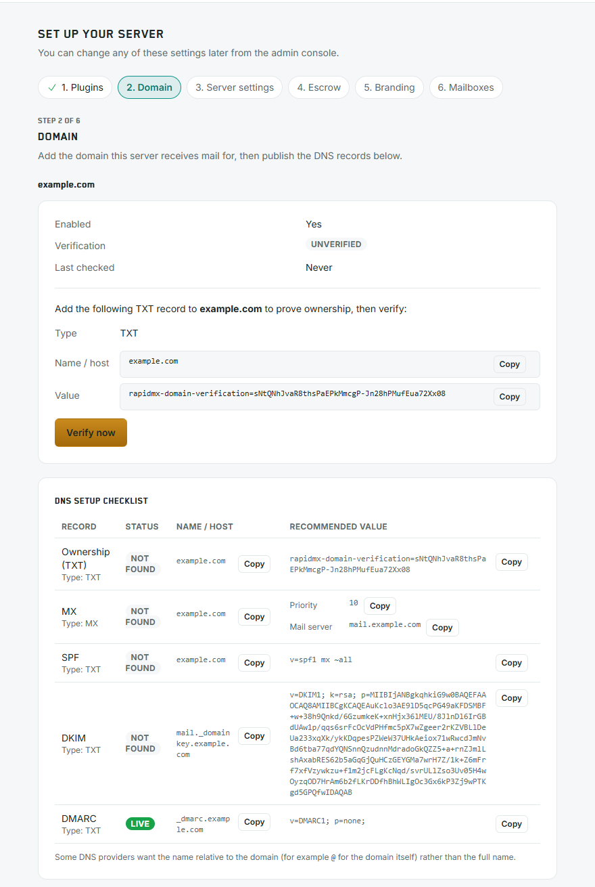
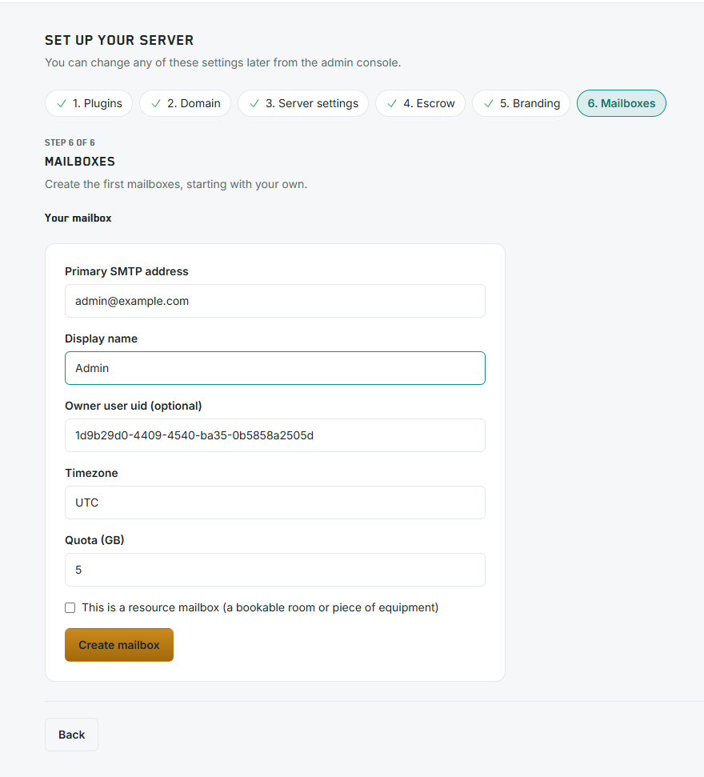
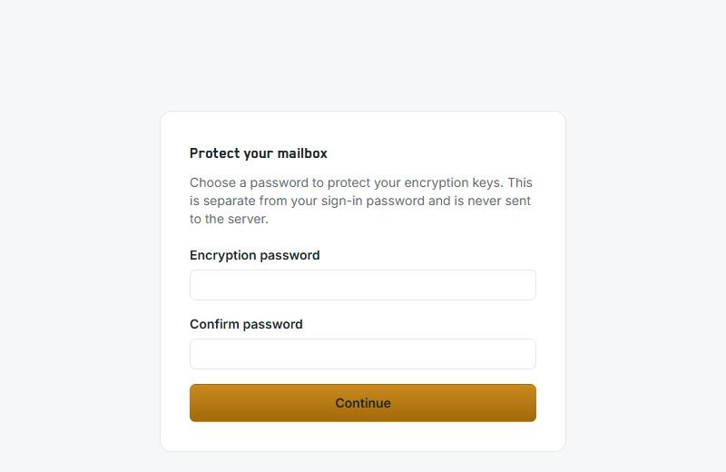
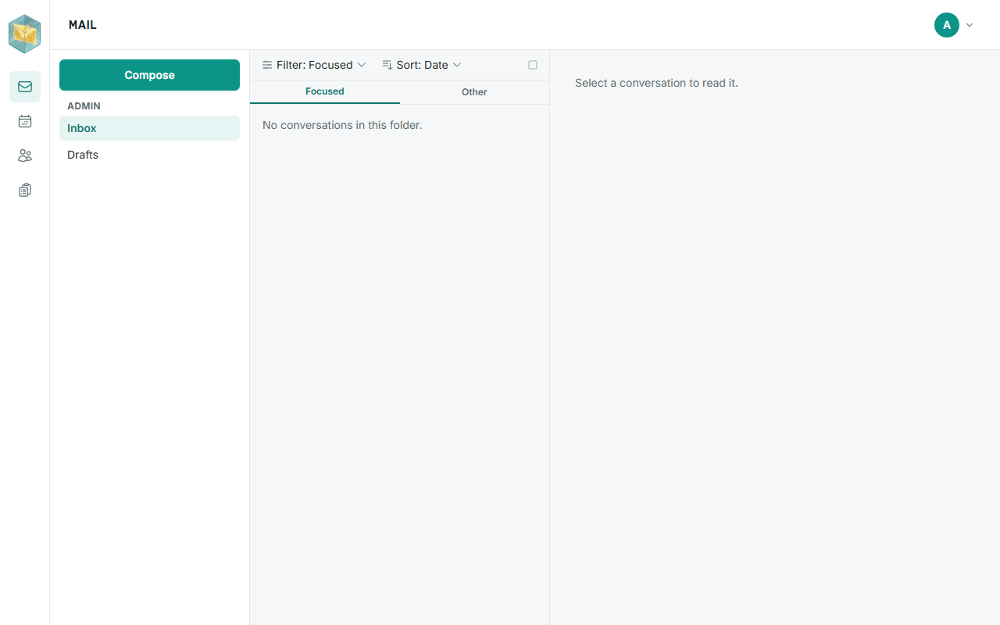

# RapidMX: Mail Server

[](https://github.com/rapidmx/server/actions/workflows/ci.yml)
[](https://coveralls.io/github/rapidmx/server?branch=main)
[](https://github.com/rapidmx/server/pkgs/container/server)

RapidMX is a self-hosted mail and collaboration server. Deploy it and you get one platform for the whole
organization: webmail with calendar, contacts and tasks, Exchange ActiveSync and MAPI over HTTP for phones and Outlook,
end-to-end encryption, spam and virus scanning, and an admin console for as many mail domains as you host, with real mail
transport (Postfix, or Amazon SES) wired in.

### Key Features

* **Webmail.** A fast React web app with conversations, a Focused/Other inbox, folders and labels, rich-text compose with
  recipient autocomplete, scheduled send and recall, read receipts, signatures, automatic replies, and filter rules. Search
  covers messages and the text of their attachments (PDF, Word, HTML), with an encrypted search index that lives in the browser.
* **Calendar, contacts and tasks.** Recurring events, meeting invitations and responses, room and resource mailboxes that
  accept bookings on their own, shareable calendar links, contact lists with vCard import and export, and tasks.
* **Booking pages.** Public scheduling pages (a plugin) that confirm by e-mail and let the guest reschedule or cancel.
* **Exchange clients.** Exchange ActiveSync (protocol versions 14.0 to 16.1) syncs mail, contacts, calendar and tasks to phones and
  tablets, with remote wipe; MAPI over HTTP connects Outlook; Autodiscover configures both. All three are plugins, installed
  by default. (There is no IMAP or POP3.)
* **End-to-end encryption.** S/MIME signing and encryption in the browser, with each user's private key kept in a vault that a
  password, a recovery code or a passkey unlocks, public-key discovery, and a policy per domain (automatic,
  optional or prohibited). Certificates come from a certificate authority the server runs, or from OpenBao's PKI.
* **Key escrow with dual control.** For organizations that must be able to recover mail: escrow scopes, access requests that
  need M-of-N approvals, and a tamper-evident, hash-chained audit log, with a console of its own.
* **Security.** rspamd spam scoring and ClamAV virus scanning (a scanner that is down quarantines instead of letting mail
  through), DKIM signing and verification, mandatory TLS between mail servers with the bundled Postfix, rate limits on public endpoints, and sign-in by
  the [auth-server](https://github.com/rapidrest/auth-server): passwords, one-time codes, authenticator apps, passkeys and
  security keys, recovery codes, and Google, Apple, Facebook and Microsoft accounts.
* **Many domains, one admin console.** Mailboxes, aliases, distribution lists (nested, with external members and sender
  restrictions), shared mailboxes with delegation, and domains, each with a live DNS checklist for its ownership, MX, SPF, DKIM
  and DMARC records. A domain you add works at once on Kubernetes, with nothing to restart.
* **Governance.** Transport rules (reject, quarantine, add a header or a recipient), retention policies, legal hold,
  eDiscovery search and export, data requests (export and erasure), a quarantine queue and an audit log.
* **Plugins and branding.** Plugins are npm packages that add API routes, pages, navigation and settings; you search, install,
  upgrade and remove them from the admin console. Give the site your own logo, title, stylesheet, header and footer.
* **Moving in and out.** Import mailboxes from mbox or PST files, and export them as mbox or JSON.
* **Runs where you do.** MongoDB or PostgreSQL, Redis, message storage on disk or in S3, Postfix or Amazon SES for mail
  transport, [OpenBao](https://openbao.org) for secrets, and Prometheus metrics. Deploy with Docker Compose, a Helm chart,
  a one-command k3s installer or a CloudFormation stack (below).

## Getting Started

Choose how to run it under [Deployment](#deployment). The Kubernetes, k3s and AWS options install the published container
image and Helm chart from the GitHub Container Registry, so there is nothing to clone or build; Docker Compose, meant for
trying RapidMX out, builds from a checkout of this repository (`git clone https://github.com/rapidmx/server`).

## Deployment

| Docker Image |                       |
| ------------ | :-------------------: |
| Registry     | ghcr.io |
| Repository   | /rapidmx/server |
| Tag          | 1.0.0-beta.10 |

Pick the way that fits you. Each one is a short list of steps, and they all finish in the same place: [Set up your server](#set-up-your-server).

| I want to... | Use | Mail transport | HTTPS |
| --- | --- | --- | --- |
| Try RapidMX on my own computer | [1. Docker Compose](#1-docker-compose) | Optional (postfix-bridge) | Bring your own |
| Run it on a Kubernetes cluster I already have | [2. Kubernetes](#2-kubernetes-helm) | Postfix, installed with the chart | Let's Encrypt |
| Run it on one Linux server, with one command | [3. Standalone k3s server](#3-standalone-k3s-server) | Postfix, installed for you | Let's Encrypt |
| Run it on AWS | [4. AWS](#4-aws-cloudformation) | Amazon SES | Let's Encrypt |

### Before you deploy

For anything that is not Docker Compose on your own computer, you need:

- **A domain you control**, for example `example.com`. Mail will be addressed to `you@example.com`.
- **A server with a public IP address**, for example `203.0.113.10`.
- **Two DNS records** pointing at that address. Create them *before* you install, so the HTTPS certificates can be issued:

  ```text
  mail.example.com.   A   203.0.113.10
  auth.example.com.   A   203.0.113.10
  ```

  `mail` is the web app and `auth` is the sign-in page. Add matching `AAAA` records if the server has an IPv6 address. (On AWS you create `CNAME` records to the load balancer instead.)
- **These ports open** to the internet: `80` and `443` for the web, and `25` for mail (not on AWS, where SES handles mail).
- **Outbound port 25 allowed** by your hosting provider. Many block it by default, and mail can't be sent without it.
- **A reverse DNS (PTR) record** for the server's address that points to `mail.example.com`. You set it at your hosting provider. It isn't required, but mail from servers without one is often treated as spam.

> **Good to know:** Let's Encrypt limits how many certificates it issues for the same names each week. Avoid installing over and over against a real domain.

### 1. Docker Compose

Best for trying RapidMX out. Everything runs on your own computer and is reachable only from it.

**You need:**

- Docker with Compose v2.20 or later (`docker compose version`)
- Git
- A few GiB of free memory (ClamAV, the virus scanner, uses about 1 GiB on its own)

**Steps:**

1. Get the code:

   ```bash
   git clone https://github.com/rapidmx/server
   cd server
   ```

2. Start everything. The first run builds the server image, which takes several minutes:

   ```bash
   docker compose -p rapidmx -f docker-compose.mongo.yml up -d --build
   ```

   - Use `docker-compose.sql.yml` instead to run on PostgreSQL rather than MongoDB, and use it in every command below too.
   - `-p rapidmx` names the project. Keep it on every command.

3. Wait until `server` and `auth-server` say `healthy`:

   ```bash
   docker compose -p rapidmx -f docker-compose.mongo.yml ps --format 'table {{.Service}}\t{{.Status}}\t{{.Ports}}'
   ```

   ```text
   SERVICE       STATUS                   PORTS
   auth-server   Up 7 minutes (healthy)   127.0.0.1:3001->3000/tcp
   clamav        Up 7 minutes (healthy)   127.0.0.1:3310->3310/tcp
   mongo         Up 7 minutes             27017/tcp
   redis         Up 7 minutes             6379/tcp
   rspamd        Up 7 minutes (healthy)   127.0.0.1:11333->11333/tcp
   server        Up 7 minutes (healthy)   127.0.0.1:3000->3000/tcp
   ```

4. Read the `admin` account's password. The auth-server made it on its first start:

   ```bash
   docker compose -p rapidmx -f docker-compose.mongo.yml exec auth-server cat /app/passwords
   ```

   ```text
   Name=admin,Password=<your password>,Roles=admin
   ```

   > **Good to know:** the file is deleted the next time the auth-server restarts. Save the password now.

5. Open <http://localhost:3000> and continue with [Set up your server](#set-up-your-server).

This setup runs in development mode with placeholder secrets, and it can't send or receive real mail until you add a mail server. To put it on the internet, use it for real mail or both, follow the steps below.

<details>
<summary><strong>Run Docker Compose for real (production)</strong></summary>

<br>

**You need:** a server with a public address and the [DNS records above](#before-you-deploy).

1. Create a file named `.env` next to the compose files, with your own secrets. Generate each `<...>` with `openssl rand -hex 32`:

   ```bash
   NODE_ENV=production
   PUBLIC_URL=https://mail.example.com
   AUTH_SERVER_PUBLIC_URL=https://auth.example.com
   MX_HOSTNAME=mail.example.com
   AUTH_AUDIENCE=example.com
   AUTH_ISSUER=auth.example.com
   AUTH_SECRET=<random>
   COOKIE_SECRET=<random>
   SESSION_SECRET=<random>
   AUTH_OAUTH_SERVER_ENCRYPTION_KEY=<random>
   ESCROW_AUDIT_HMAC_KEY=<random>
   MAIL_INGEST_SECRET=<random>
   SENDMAIL_RELAY_HOST=postfix
   ```

   > **Good to know:** with `NODE_ENV=production` the server refuses to start while any of these secrets is still a placeholder. Never change `ESCROW_AUDIT_HMAC_KEY` after the first start.

2. Let the sign-in cookie work across `mail.` and `auth.`. Create `docker-compose.prod.yml`:

   ```yaml
   services:
     auth-server:
       environment:
         - auth__cookie__access__domain=.example.com
         - auth__cookie__refresh__domain=.example.com
   ```

3. Start it with both files:

   ```bash
   docker compose -p rapidmx -f docker-compose.mongo.yml -f docker-compose.prod.yml up -d --build
   ```

4. Add HTTPS. The stack doesn't do it for you, and it only listens on `127.0.0.1`. Put a reverse proxy on the host (Caddy, nginx or Traefik) in front of it:

   - `https://mail.example.com` → `http://127.0.0.1:3000`
   - `https://auth.example.com` → `http://127.0.0.1:3001`

5. Add the mail server. In a checkout of [postfix-bridge](https://github.com/rapidmx/postfix-bridge), create a `.env`:

   ```bash
   MAIL_HOSTNAME=mail.example.com
   MAIL_DOMAINS=example.com
   MTA_INGEST_BASE_URL=http://server:3000/internal/mta
   MTA_INGEST_SECRET=<the same value as MAIL_INGEST_SECRET>
   ```

   Start it **in the same project**, so both stacks share a network and the DKIM keys:

   ```bash
   docker compose -p rapidmx up -d --build
   ```

   > **Good to know:** Compose warns about "orphan containers" from now on. That is expected. Never answer it with `--remove-orphans`.

6. Postfix starts with a self-signed certificate and requires TLS from other mail servers. Copy a real certificate for `mail.example.com` into its `postfix_tls` volume as `tls.crt` and `tls.key`, then restart it:

   ```bash
   docker compose -p rapidmx restart postfix
   ```

7. Whenever you add a mail domain in the admin console, also add it to `MAIL_DOMAINS` and restart Postfix (the same command). Kubernetes doesn't need this.

**Settings you can put in `.env`:**

| Variable | What it does |
| --- | --- |
| `AUTH_SECRET` | Signs sign-in tokens. Must be the same on the server and the auth-server, which the compose file guarantees. |
| `AUTH_AUDIENCE` / `AUTH_ISSUER` | The `aud` and `iss` of those tokens. |
| `AUTH_SERVER_PUBLIC_URL` | The address browsers use to reach the auth-server. |
| `AUTH_OAUTH_SERVER_ENCRYPTION_KEY` | The auth-server's OAuth key-encryption key. |
| `COOKIE_SECRET`, `SESSION_SECRET` | Sign cookies and sessions. |
| `ESCROW_AUDIT_HMAC_KEY` | Keys the tamper-evident escrow audit log. Generate once, never change. |
| `MAIL_INGEST_SECRET` | Lets postfix-bridge call the server. Must equal its `MTA_INGEST_SECRET`. |
| `PUBLIC_URL`, `MX_HOSTNAME` | This server's public address and its mail host name, used in booking links, autodiscover and the DNS checklist. |
| `SENDMAIL_RELAY_HOST` / `_PORT` / `_TLS` | Where outgoing mail is handed to Postfix. `postfix` when both stacks share a project. |

Postfix's TLS settings, DKIM and DMARC are documented in the [postfix-bridge](https://github.com/rapidmx/postfix-bridge) README.

</details>

### 2. Kubernetes (Helm)

Best when you already run a Kubernetes cluster. One Helm chart installs everything.

**You need:**

- A cluster, `kubectl` and Helm 3.8 or later
- A default `StorageClass`
- A [Gateway API](https://gateway-api.sigs.k8s.io/) controller with a `GatewayClass`, such as [Envoy Gateway](https://gateway.envoyproxy.io/) (the chart expects the class `envoy`; change it with `global.gateway.className`)
- [cert-manager](https://cert-manager.io/) with Gateway API support turned on (`--set config.enableGatewayAPI=true`), for Let's Encrypt certificates
- A way to expose port 25 (the `postfix` Service is a `LoadBalancer`)
- The [DNS records above](#before-you-deploy)

**Steps:**

1. Check the cluster is ready:

   ```bash
   kubectl get nodes
   kubectl get gatewayclass
   helm version --short
   ```

   `kubectl get gatewayclass` should list your class (for example `envoy`) as accepted.

2. Install the chart. Replace `example.com` with your domain:

   ```bash
   helm upgrade --install --create-namespace --namespace rapidmx rapidmx \
     oci://ghcr.io/rapidmx/charts/server --version 1.0.0-beta.10 \
     --set global.domain=example.com \
     --set global.jwt.secret="$(openssl rand -hex 32)" \
     --set global.mailIngestSecret="$(openssl rand -hex 32)"
   ```

   - `global.domain` is your mail domain. From it, the web app becomes `mail.example.com` and sign-in `auth.example.com`.
   - `global.jwt.secret` and `global.mailIngestSecret` are two random secrets. Keep them: an upgrade needs the same values (or `--reset-then-reuse-values`, see [Upgrading](#upgrading)).

3. Watch it start. Every pod should reach `Running` (ClamAV takes a few minutes):

   ```bash
   kubectl -n rapidmx get pods --watch
   ```

4. Find the addresses for your DNS records:

   ```bash
   kubectl -n rapidmx get gateway
   kubectl -n rapidmx get svc postfix
   ```

   Point `mail.example.com` and `auth.example.com` at the Gateway's address. Postfix must be reachable on `mail.example.com` too, because that is the name other mail servers connect to.

   > **Good to know:** if the Gateway and the `postfix` Service get different addresses, give Postfix a name of its own: add `--set postfixBridge.hostname=mx.example.com --set postfixBridge.tls.certManager.enabled=false` to the install, point `mx.example.com` at the `postfix` Service and use it as your MX record (Postfix then uses a self-signed certificate).

5. Wait for the certificates to be issued (`READY` is `True`):

   ```bash
   kubectl -n rapidmx get certificate
   ```

   ```text
   NAME               READY   SECRET                      AGE
   auth.example.com   True    auth.example.com-tls-cert   41h
   mail.example.com   True    mail.example.com-tls-cert   41h
   ```

6. Read the `admin` account's password:

   ```bash
   kubectl -n rapidmx get secret rapidmx-authserver-service-secrets -o jsonpath='{.data.default_accounts}' \
     | base64 -d | tr -d '\\' | sed -n 's/.*"password":"\([^"]*\)".*/\1/p'
   ```

7. Open `https://mail.example.com` and continue with [Set up your server](#set-up-your-server).

> **Good to know:**
>
> - Already have a Gateway? Point `global.gateway.name` and `global.gateway.namespace` at it. See the [chart reference](#helm-chart-reference).
> - Want the secrets in a vault instead of Kubernetes Secrets? See [Secrets and OpenBao](#secrets-and-openbao).
> - Installing from a checkout instead of GHCR: `helm repo add bitnami https://charts.bitnami.com/bitnami`, then `helm dep up ./helm`, then use `./helm` in place of the `oci://` address.

### 3. Standalone k3s server

Best for one Linux server. A single script installs k3s (a small Kubernetes), HTTPS, mail and RapidMX.

**You need:**

- A Debian, Ubuntu or RHEL-family Linux server with `sudo` and about 8 GiB of memory
- The [DNS records above](#before-you-deploy), and ports `25`, `80` and `443` open
- No Docker running on the same server (it conflicts with k3s)

**Steps:**

1. Point `mail.example.com` and `auth.example.com` at the server's public address.

2. Download the script:

   ```bash
   curl -fsSLO https://raw.githubusercontent.com/rapidmx/server/main/single_node_install.sh
   chmod +x single_node_install.sh
   ```

3. Run it with your domain and an email address for Let's Encrypt:

   ```bash
   ./single_node_install.sh --domain example.com --email you@example.com
   ```

   It takes several minutes and prints each step as it goes.

4. Wait for the final message:

   ```text
   Installation complete.
   The server is at https://mail.example.com, with sign-in at https://auth.example.com.
   Postfix listens on port 25 as mail.example.com and knows example.com. Add each domain in the admin console, ...
   ```

5. Read the `admin` account's password:

   ```bash
   kubectl -n rapidmx get secret rapidmx-authserver-service-secrets -o jsonpath='{.data.default_accounts}' \
     | base64 -d | tr -d '\\' | sed -n 's/.*"password":"\([^"]*\)".*/\1/p'
   ```

6. Open `https://mail.example.com` and continue with [Set up your server](#set-up-your-server).

**Options:**

| Option | What it does |
| --- | --- |
| `--domain example.com` | Your mail domain (required) |
| `--email you@example.com` | The Let's Encrypt account address (default `admin@<domain>`) |
| `--mail-host` / `--auth-host` | Change `mail` / `auth` to another name, for example `--mail-host webmail` |
| `--tls false` | No certificates: plain HTTP, for testing |
| `--openbao false` | Keep secrets in Kubernetes Secrets instead of OpenBao |
| `--version <version>` | Install a specific release |
| `--uninstall` | Remove what the script installed |
| `--help` | List everything |

> **Good to know:**
>
> - The certificates are requested during the install and issued once both names point at the server. You can add the DNS records afterwards; `kubectl -n rapidmx get certificate` shows when they are ready.
> - To try it without a public domain, use a name that ends in `.local`, such as `--domain example.local`. It serves plain HTTP; add both names to your hosts file, as the script reminds you.

### 4. AWS (CloudFormation)

Best for AWS. One CloudFormation stack creates the network, an EC2 instance and everything on it. Mail goes through Amazon SES. See [deploy/aws/README.md](deploy/aws/README.md) for all the options.

**You need:**

- An AWS account and the [AWS CLI](https://aws.amazon.com/cli/), signed in (`aws sts get-caller-identity`)
- A Route 53 hosted zone for your domain (optional, but it creates the DNS records for you)
- SES out of the sandbox in your region, or a verified recipient address to test with. New accounts start in the sandbox; request production access in the SES console.
- A checkout of this repository, for the template

**Steps:**

1. Create the stack. Replace the domain, the hosted zone and the version:

   ```bash
   aws cloudformation deploy --stack-name rapidmx --template-file deploy/aws/rapidmx-server.yaml \
     --capabilities CAPABILITY_IAM \
     --parameter-overrides Domain=example.com HostedZoneId=Z123EXAMPLE ChartVersion=<version>
   ```

   - `Domain` is your mail domain, **not** `mail.example.com`.
   - Leave out `HostedZoneId` if you don't use Route 53.
   - Always set `ChartVersion` to the release named in the Docker Image table at the top of [Deployment](#deployment): the template's default is an older one.
   - The command returns once the whole install has finished. A failed install fails the stack.

2. Read the stack's outputs:

   ```bash
   aws cloudformation describe-stacks --stack-name rapidmx --query 'Stacks[0].Outputs'
   ```

3. Read the install summary. It holds the load balancer's name, the generated secrets and the exact command for step 5. Run the `SummaryCommand` output, which uses AWS Session Manager.

4. Without a hosted zone, create two `CNAME` records that point `mail.example.com` and `auth.example.com` at the load balancer named in the summary.

5. Deploy [ses-bridge](https://github.com/rapidmx/ses-bridge) for inbound mail, using the command from the summary. It creates the SES identity for your domain.

6. Finish the SES setup. `ses-bridge` prints each of these when it finishes:

   - Publish the three DKIM `CNAME` records it lists.
   - Point your domain's `MX` record at the value it lists, with priority `10`.
   - Activate the SES receipt rule set.

7. Turn on e-mail from the sign-in page (one-time codes). SES SMTP can't use the instance's role, so [create an SES SMTP account](https://docs.aws.amazon.com/ses/latest/dg/smtp-credentials.html), open a Session Manager shell on the instance and run the installer again with its credentials:

   ```bash
   sudo -i
   export RAPIDMX_DOMAIN=example.com RAPIDMX_CHART_VERSION=<version>
   export RAPIDMX_SES_SMTP_USERNAME=<username> RAPIDMX_SES_SMTP_PASSWORD=<password>
   curl -fsSL https://raw.githubusercontent.com/rapidmx/server/main/deploy/aws/bootstrap.sh -o /root/rapidmx-bootstrap.sh
   bash /root/rapidmx-bootstrap.sh
   ```

   Running it again keeps your existing secrets. Export the same values you gave the stack (`RAPIDMX_HOSTED_ZONE_ID`, `RAPIDMX_ACME_EMAIL`, `RAPIDMX_MAIL_HOST` and so on, if you set them), or they go back to their defaults. Without this step the sign-in page can't send e-mail, and the installer's summary says so.

8. Read the `admin` account's password, in the same shell:

   ```bash
   export KUBECONFIG=/etc/rancher/k3s/k3s.yaml
   kubectl -n rapidmx-server get secret rapidmx-server-authserver-service-secrets -o jsonpath='{.data.default_accounts}' \
     | base64 -d | tr -d '\\' | sed -n 's/.*"password":"\([^"]*\)".*/\1/p'
   ```

9. Open `https://mail.example.com` and continue with [Set up your server](#set-up-your-server).

### Set up your server

Every option above ends here. You sign in as `admin`, add your mail domain and create your first mailbox. (With Docker Compose, use `http://localhost:3000` in place of `https://mail.example.com`.)

1. Open `https://mail.example.com`. It sends you to the sign-in page. Enter `admin`, then the password you read earlier.

   

2. Open the admin console at `https://mail.example.com/admin`. It asks for your password once more.

   

3. The **Set up your server** wizard opens. Step 1, **Plugins**, is fine as it is: the recommended plugins (ActiveSync, Autodiscover, MAPI and booking pages) are already on. Click **Continue**.

   

4. Step 2, **Domain**. Type your mail domain, for example `example.com`, and click **Add domain**. RapidMX shows the DNS records it needs.

   - Add each record at your DNS provider, exactly as shown (use the **Copy** buttons).
   - Click **Verify now**. Each row of the checklist turns `LIVE` once its record is found. (DNS changes can take a few minutes.)

   

   The records look like this. Your ownership token and DKIM key are shown in the console:

   | Type | Name | Value |
   | --- | --- | --- |
   | `TXT` | `example.com` | `rapidmx-domain-verification=<token>` |
   | `MX` | `example.com` | `10 mail.example.com` |
   | `TXT` | `example.com` | `v=spf1 mx ~all` |
   | `TXT` | `mail._domainkey.example.com` | `v=DKIM1; k=rsa; p=<public key>` |
   | `TXT` | `_dmarc.example.com` | `v=DMARC1; p=none;` |

   > **Good to know:** until the ownership record is found, the domain can't send or receive mail. On AWS the DKIM and MX records come from `ses-bridge` (step 6 of the AWS steps), so those rows of the checklist may stay red; the ownership record is the one to add here.

5. Steps 3 to 5: **Server settings**, **Escrow** and **Branding**. Every default is safe, so click **Continue** through them. Change them later if you like.

   - *Server settings:* whether encryption is automatic, how long mail is kept, and whether people can create their own mailbox.
   - *Escrow:* lets a trusted group recover encrypted mail. Choose **Don't use escrow** if you don't need it.
   - *Branding:* your own logo, name and styles.

6. Step 6, **Mailboxes**. Create your own mailbox, for example `admin@example.com`, and click **Create mailbox**, then **Finish setup**. (Leave the owner as it is: it links the mailbox to the account you signed in with.)

   

7. Open `https://mail.example.com` again. Mail asks you to protect your encryption keys: choose an **encryption password** (different from your sign-in password), then save the **recovery codes** it shows. They are the only way back in if you forget it.

   

8. Your inbox opens.

   

   > **Good to know:** mail only flows once your DNS records are in place and a mail server is running. The Docker Compose quick start has none, so it can't send or receive real mail until you add one.

To add more domains and mailboxes later, open the admin console again: **Domains** and **Mailboxes**. On Kubernetes and k3s a new domain works within seconds, with nothing to restart. On AWS, deploy `ses-bridge` again for each additional domain.

### Upgrading

**Back up the database first.** The server updates its own database schema when it starts (there are no migration scripts), and on PostgreSQL a column whose type changed between releases can lose its data.

- **Docker Compose:** pull the new code and start again.

  ```bash
  git pull
  docker compose -p rapidmx -f docker-compose.mongo.yml up -d --build
  ```

- **Kubernetes, k3s and AWS:** upgrade the Helm release. The k3s script installs a release named `rapidmx` in the namespace `rapidmx`. On AWS both are `rapidmx-server`, and you run the command on the instance after `export KUBECONFIG=/etc/rancher/k3s/k3s.yaml`:

  ```bash
  helm upgrade rapidmx oci://ghcr.io/rapidmx/charts/server --version <version> --namespace rapidmx \
    --reset-then-reuse-values --wait --timeout 10m
  ```

  `--reset-then-reuse-values` (Helm 3.14 or later) keeps every value you set and picks up new defaults. Don't use plain `--reuse-values`: it misses new defaults and the upgrade can fail.

- **k3s and AWS scripts:** re-running the script with `--version <version>` (or `RAPIDMX_CHART_VERSION` on AWS) does the same, and re-checks nginx, the Gateway and the other pieces too.

## Reference

Everything above is enough to run RapidMX. This section is for when you need more.

### Helm chart reference

Real inbound/outbound mail transport (Postfix, DKIM signing and [`postfix-bridge`](https://github.com/rapidmx/postfix-bridge)) is the
`postfixBridge` dependency, installed with the chart. `postfixBridge.hostname` is Postfix's MX
host name (default `mail.<global.domain>`), which gets a Let's Encrypt certificate from the chart's own cert-manager Issuer, and
`postfixBridge.domains` the domains Postfix knows when it starts (default `<global.domain>`; every domain you add in the admin console works
at once, without a restart or an upgrade); the render fails if a public `host` is left with a placeholder for either. The chart also
issues the server's own certificate for the same name, so to have Postfix present that one rather than ask Let's Encrypt for a second (it
limits duplicates) set `postfixBridge.tls.existingSecret` to `<host>-tls-cert`, as `single_node_install.sh` does. Without cert-manager, set `postfixBridge.tls.certManager.enabled=false` for a self-signed certificate, or
`postfixBridge.tls.existingSecret` to your own. Postfix signs mail with the DKIM keys the server writes to its
`mail.dkim.storage` volume, so with the default `ReadWriteOnce` both pods must run on the same node. Set `postfixBridge.create=false` to install postfix-bridge as its
own release instead; the release notes (`helm get notes`) then say how to connect it.

On AWS, set `mail.transport.provider=ses` with `postfixBridge.create=false` to send through SES instead of Postfix
(`mail.transport.ses.region`, and inbound mail through [`ses-bridge`](https://github.com/rapidmx/ses-bridge)); the render
fails if both are on at once. The pod gets its AWS credentials from `serviceAccount.create` with an
`eks.amazonaws.com/role-arn` annotation (IRSA) or from the node's own role, and `mail.ingestService.enabled` adds an
internal load balancer for `/internal/mta`, which ses-bridge's Lambda calls from inside the VPC - the public Gateway
still answers 404 for `/internal`. Restrict it with `mail.ingestService.loadBalancerSourceRanges`.

The bundled auth-server sends its sign-in and verification codes by e-mail, which it can only do over SMTP, so it has its own
settings, `global.smtp` (the auth-server subchart can't read `mail.*`). They default to the bundled Postfix over the cluster
network (host `postfix`, port 25, no TLS on that hop) from `noreply@<global.domain>` (`global.smtp.from`). With SES, point
`global.smtp.host` at `email-smtp.<region>.amazonaws.com` (port 587, `ignoreTLS=false`, `requireTLS=true`) and give it an SES
SMTP account's `smtp_config__auth__user` / `smtp_config__auth__pass` from a Secret through `authserver.service.extraEnv`
(`deploy/aws/bootstrap.sh` does all of this from `RAPIDMX_SES_SMTP_USERNAME` and `RAPIDMX_SES_SMTP_PASSWORD`).

`global.domain` is the deployment's mail domain (e.g. `example.com`): mail is addressed `@<domain>`, the server is served
at `host` (`mail.<domain>` by default), the auth-server at `authserver.host` (`auth.<domain>` by default), and the JWT audience
and issuer are the domain and that auth host on both sides. Postfix's MX name and sender domains follow the same value.

#### Secrets and OpenBao

With `global.openbao.enabled` this release keeps its secrets in [OpenBao](https://openbao.org): the JWT signing secret
shared with auth-server, the cookie, session and escrow audit keys, the postfix-bridge ingest secret, and the certificate
authority for end-to-end encrypted mail (`mail:pki:backend`, an OpenBao PKI mount instead of the local CA on disk). [External Secrets](https://external-secrets.io) copies the values into the Kubernetes Secrets the pods already
load, so nothing in the application changes. The bundled auth-server reads the same vault path, so both sides share one
JWT secret without either value being passed in.

**OpenBao is a prerequisite, like cert-manager - the chart doesn't install it**, which is why the value is off by
default: a plain `helm install` shouldn't assume a vault is there. `single_node_install.sh` and `deploy/aws` do install
one and turn it on (`--openbao true` / `RAPIDMX_OPENBAO`, on by default there): they install it, initialise it, keep the unseal
key in a Kubernetes Secret with an unsealer Deployment that re-unseals the vault after any restart, write this release's
secrets (each value once - never rewritten, so an upgrade doesn't invalidate sessions or re-key the escrow chain), set up
the PKI mount and issuing role, and create the two token Secrets. External Secrets has to be there too; its CRDs are
cluster-wide, so the chart can't bring it, and the render fails with the exact command when it's missing.

Point `global.openbao.address` at an OpenBao you already run to use that one instead (`auth.method: kubernetes` avoids
storing a token at all). It has to hold, under `global.openbao.kvMount` at `global.openbao.secretsPath`
(`<release>/secrets` by default), the fields `auth_secret`, `cookie_secret`, `session__secret`,
`escrow_audit_hmac_key` and `mail_ingest_secret`; `global.openbao.auth.tokenSecret` names a Secret whose `token` may read
them. For the encryption CA, a PKI mount (`openbao.pki.mount`) with an issuing role (`openbao.pki.role`) that accepts an
email address as the common name, and `openbao.pki.tokenSecret` naming a Secret whose `mail__pki__openbao__token` may
`update` on `<mount>/sign/<role>` and `<mount>/revoke` - the server signs client CSRs, so the CA key never leaves the
vault. Leave `openbao.pki.tokenSecret` empty to keep the local CA on the `pki-data` volume.

Keeping the unseal key in a Secret is what makes the deployment heal itself after a reboot, at the cost that anyone who
can read Secrets in the vault's namespace can unseal it (roughly what those Secrets exposed before). A cluster with a KMS
to auto-unseal from should run its own vault and be pointed at instead.

Left off (the chart's default), everything stays in Kubernetes Secrets, in which case:

The chart needs two secrets you supply: `global.jwt.secret` (the JWT secret, shared with the bundled auth-server, which reads
the same value: leave it out and each of the two generates its own, so the server rejects every sign-in) and
`global.mailIngestSecret` (shared with postfix-bridge; the render fails without it). Pass the same values
again on every upgrade (or use `--reset-then-reuse-values`). Cookie, session and escrow audit (`mail.escrow.auditHmacKey`) secrets are generated on install and
kept - which needs cluster access, so rendering the chart without it (`helm template`, Argo CD/Flux, `--dry-run`) fails
until you set `cookies.secret`, `sessions.secret` and `mail.escrow.auditHmacKey` explicitly or point
`secrets.existingSecret` at a Secret you manage. Outbound mail is relayed to postfix-bridge's `postfix`
Service (`mail.relay.*`). By default the chart creates a Gateway for each of its hosts (`host` and
`authserver.host`, `global.gateway.className`) and has cert-manager issue their certificates from an Issuer of its own
(`global.certmanager.*`, Let's Encrypt over HTTP-01 through that Gateway); `global.gateway.tls=false` serves plain HTTP.
To use one Gateway you already have, point `global.gateway.name` and `global.gateway.namespace` at it (the auth-server
subchart shares them). The route names no listener, so it attaches to every listener there that accepts the host, and with
TLS on the chart renders the ReferenceGrant that lets the Gateway read each `<host>-tls-cert` Secret in the release's
namespace - the Gateway needs an HTTPS listener for each host that terminates TLS with that Secret. With Envoy Gateway the
chart also attaches a `BackendTrafficPolicy` that compresses the API's JSON and the pages' HTML (brotli, else gzip;
`global.gateway.compression.enabled`: `auto` renders it when the cluster has that API, `true`/`false` force it; it does
nothing with `global.gateway.tlsTermination=pod`, where Envoy only passes the bytes through). The browser bundles and static
files are compressed by the server itself, and Envoy leaves a response that already carries `Content-Encoding` alone. The usual naming is
`host: mail.<domain>` with `authserver.host: auth.<domain>`, which is what `global.domain` alone gives you; sign-in redirects to
`authserver.host`. `mail.trustedAuthservId` is the authserv-id of the `Authentication-Results`
header your inbound MTA stamps, which the server trusts to say whether a sender's DKIM signature verified; with the bundled
Postfix it defaults to Postfix's host name (`postfixBridge.hostname`), and with any other MTA (ses-bridge, your own) you set it.
While it's empty no sender is DKIM-verified, so members-only distribution lists drop all mail, list and forward-rule
copies get a rewritten From, and forwarded invites are refused. `/api/metrics`
requires a token with a trusted role, so scrape it with a bearer token rather than `prometheus.io/*` annotations.

The chart runs one replica by default, because its message, DKIM and PKI volumes are `ReadWriteOnce`. To run more,
use `mail.blob.backend: s3` (or `ReadWriteMany` storage) and `ReadWriteMany` for `mail.dkim.storage` and
`mail.pki.storage`.

### Notes for upgrades

The server has no database migrations: on startup it creates and updates its schema from its models
(`datastores.*.synchronize`, the chart's `service.datastores.synchronize`, on by default). That's how an upgrade adds new
collections, tables and columns, but on PostgreSQL TypeORM may drop and recreate a column whose type changed between
releases, losing that column's data. If you manage schema changes yourself,
set `datastores__acl__synchronize` and `datastores__sql__synchronize` (or `datastores__mongo__synchronize`) to `false`.

**Booking pages moved to a plugin.** The public booking pages (`/book`), Settings → Booking Links and the
`/api/mail/booking-types` and `/api/mail/bookings` APIs are now `@rapidmx/booking-plugin`, one of the default plugins
(`system:plugins:defaults`). An upgraded deployment adds it at its next start, and its existing booking types and
bookings show up again unchanged, since the plugin uses the same collections and tables. `mail:booking:public_url` (the
chart's `mail__booking__public_url`) still sets the address in booking emails; it's also the plugin's setting in the
admin console, and an environment variable wins over the saved value. Until `@rapidmx/booking-plugin` is published to
npm, adding it logs "Could not add default plugin @rapidmx/booking-plugin" at each start, the other plugins install and
load as usual, and booking stays unavailable. To use a local build before then, point `system__plugins__sources` at its
`npm pack` tarball.

### Plugin UI

Plugins can ship pages (for example `@rapidmx/booking-plugin`'s booking pages) and navigation entries along with their
API routes. They ship those pages as TSX sources, so when enabled plugins have UI the server builds the browser bundles
with Vite as it starts, together with its own apps, before it starts serving. The build is kept in
`system:plugins:dir`'s `.ui-build` folder (`/app/plugins/.ui-build` in the image) and reused until the plugins with UI,
their versions, or the server's web client change. Without plugin UI nothing is built and the bundles in the image are
served; the last build is kept, so turning the same plugins back on reuses it.

- **Build time:** the first start after a plugin with UI is added, upgraded, enabled or disabled takes longer, from a few
  seconds on a typical node to about a minute on a small CPU limit. On Kubernetes the plugins volume is per pod, so every
  new pod builds once.
- **Memory:** the build adds a few hundred MiB while it runs, which is why the chart's default memory request and limit
  (`service.resources`) are 512Mi and 1536Mi.
- **Failures never stop the server:** a plugin whose UI fails to build is left out (its pages 404, its navigation entries
  are hidden and the admin console's plugin status shows the error), and the rest are rebuilt without it. A page whose
  path clashes with another plugin's pages or with any other route isn't served either.

## Static Files

The server sends the browser build (`dist/public`: `/assets`, `/fonts`, `/images`, `/styles`, `/favicon.ico`, or the plugin UI
build that replaces it) itself, from `src/routes/BaseStaticAssetRoute.ts`: the right `Content-Type` (WebAssembly included),
`ETag` with `304 Not Modified`, `HEAD`, and brotli/gzip. Fingerprinted bundles (`/assets/<name>-<hash>.js`) get
`Cache-Control: public, max-age=31536000, immutable`, so a browser fetches each one once; other files are cached for an hour
(images, fonts) or revalidated (CSS/JS/HTML). `yarn build` writes `.br` and `.gz` files next to every compressible file
(`scripts/precompress-assets.mjs`), which are sent as they are; a file without them is compressed on first request and kept in
memory. The plugin UI build gets its own at startup. `static_assets:compress`, `static_assets:memory_cache_bytes` and
`static_assets:brotli_quality` configure it (see `config.mongo.ts`).

## Local Development

`yarn dev` runs the server from source with `NODE_ENV=development`, signing every request in as a dev admin user. Mail
can be composed and sent without the scanning stack or an MTA, so neither Docker nor Postfix is required:

- **Spam and virus scanning:** while rspamd or clamd can't be connected to at all (connection refused, a host name that
  doesn't resolve, or a connection timeout), scans are treated as clean and the server logs a `[dev] ... is unreachable`
  warning when it starts bypassing and then at most every five minutes. Start the scanners with
  `docker compose -f docker-compose.mail.yml up -d` to scan for real; once they answer, their verdicts are used again.
- **Sending:** without a `sendmail` binary at `mail:transport:sendmail:path` (default `/usr/sbin/sendmail`), a sent
  message is delivered straight to this server's own mailboxes through the same ingest path Postfix uses, and arrives in
  the recipient's Inbox. Other recipients are rejected, and a message with no local recipient fails to send; relaying
  them needs the [`postfix-bridge`](https://github.com/rapidmx/postfix-bridge) stack.

This only happens with `NODE_ENV` `dev`, `development` or `test`. With any other `NODE_ENV` the real providers are
registered unchanged, and a scanner outage makes every send fail closed.

## Debugging

[Visual Studio Code](https://code.visualstudio.com/) is the recommended IDE to develop with. The project includes workspace and launch configuration files out of the box.

To debug while running via Docker Compose select the `Docker: Attach Debugger` configuration and hit the `F5` key. If you want to run the server directly and debug choose the `Launch Server` configuration.